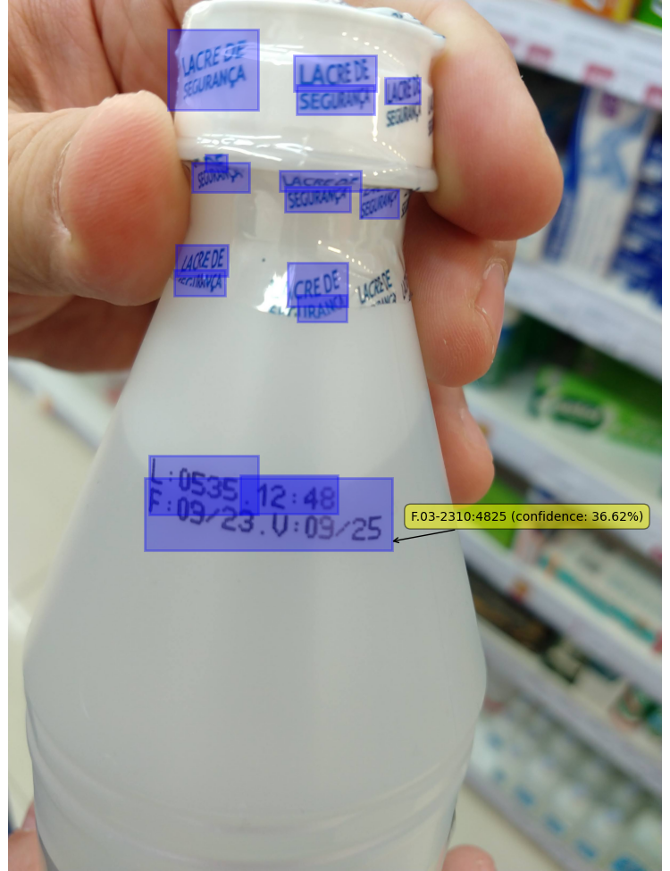

# Resultados do desafio OCR

* 07/02/24
* A biblioteca utilizada para os novos testes foi a DocTR
* Foi utilizado um modelo pré-treinado para identificar onde está a validade do produto
* Para o teste foram usadas 50 imagens com diferentes tipos de fontes e iluminações a fim de concluir o comportamento amplo da biblioteca
* As imagens foram testadas usando dois parametros do modelo, assume_straight_pages=True/False
* Das 50 imagens conclui-se que 
	- A ferramenta do Google Cloud Vision API reconheceu 
	- O modelo reconheceu

## Testes

Segue o resultado dos testes

### Teste 1

#### DocTR

#### Google Cloud Vision API

### Teste 2

#### DocTR

#### Google Cloud Vision API

### Teste 3

#### DocTR

#### Google Cloud Vision API

### Teste 4

#### DocTR

#### Google Cloud Vision API

### Teste 5

#### DocTR

#### Google Cloud Vision API

### Teste 6

#### DocTR

#### Google Cloud Vision API

### Teste 7

#### DocTR

#### Google Cloud Vision API

### Teste 8

#### DocTR

#### Google Cloud Vision API

### Teste 9

#### DocTR

#### Google Cloud Vision API

### Teste 10

#### DocTR

#### Google Cloud Vision API

### Teste 11

#### DocTR

#### Google Cloud Vision API

### Teste 12

#### DocTR

#### Google Cloud Vision API

### Teste 13

#### DocTR

#### Google Cloud Vision API

### Teste 14

#### DocTR

#### Google Cloud Vision API

### Teste 15

#### DocTR

#### Google Cloud Vision API

### Teste 16

#### DocTR

#### Google Cloud Vision API

### Teste 17

#### DocTR

#### Google Cloud Vision API

### Teste 18

#### DocTR

#### Google Cloud Vision API

### Teste 19

#### DocTR

#### Google Cloud Vision API

### Teste 20

#### DocTR

#### Google Cloud Vision API

### Teste 21

#### DocTR

#### Google Cloud Vision API

### Teste 22

#### DocTR

#### Google Cloud Vision API

### Teste 23

#### DocTR

#### Google Cloud Vision API

### Teste 24

#### DocTR

#### Google Cloud Vision API

### Teste 25

#### DocTR

#### Google Cloud Vision API

### Teste 26

#### DocTR

#### Google Cloud Vision API

### Teste 27

#### DocTR

#### Google Cloud Vision API

### Teste 28

#### DocTR

#### Google Cloud Vision API

### Teste 29

#### DocTR

#### Google Cloud Vision API

### Teste 30

#### DocTR

#### Google Cloud Vision API

### Teste 31

#### DocTR

#### Google Cloud Vision API
