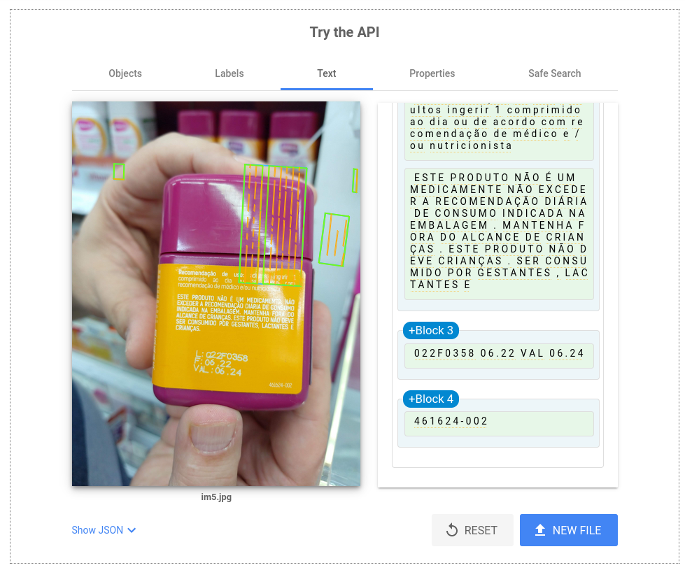
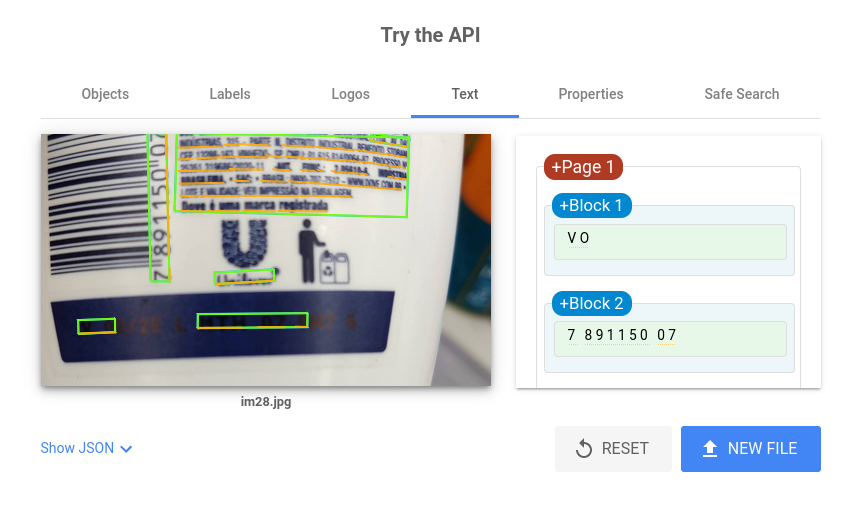
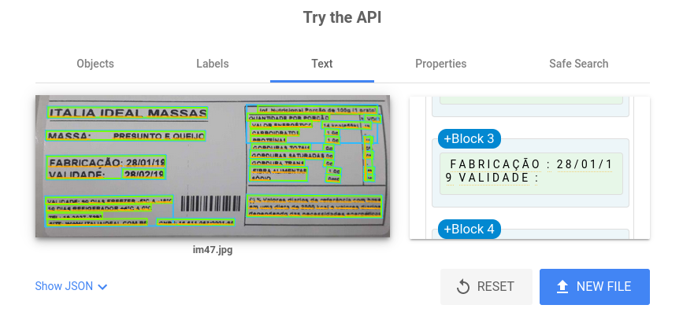

# Resultados do desafio OCR

* 07/02/24
* A biblioteca utilizada para os novos testes foi a DocTR
* Foi utilizado um modelo pré-treinado para identificar onde está a validade do produto
* Para o teste foram usadas 50 imagens com diferentes tipos de fontes e iluminações a fim de concluir o comportamento amplo da biblioteca
* As imagens foram testadas usando dois parametros do modelo, assume_straight_pages=True/False

## Conclusões

* Das 50 imagens conclui-se que 
	- A ferramenta do Google Cloud Vision API reconheceu 41 datas certas
	- O modelo docTR reconheceu 36 datas certas
* A biblioteca docTR trabalha melhor com imagens não manipuladas
* O reconhecimento é mais preciso com o parâmento assume_straight_pages=True, logo, é mais preciso quando a data está horizontal
* A ferramenta Google Cloud Vision API mudou a posição da imagem e as boxes ficaram descentralizadas com o texto visualmente
* Ambas ferramentas têm maior precisão com os textos focalizados

## Testes

Segue o resultado dos testes

### Teste 1

#### DocTR

#### Google Cloud Vision API

### Teste 2

#### DocTR

#### Google Cloud Vision API

### Teste 3

#### DocTR

#### Google Cloud Vision API

### Teste 4

#### DocTR

#### Google Cloud Vision API

### Teste 5

#### DocTR

#### Google Cloud Vision API

### Teste 6

#### DocTR

#### Google Cloud Vision API

### Teste 7

#### DocTR

#### Google Cloud Vision API

### Teste 8

#### DocTR

#### Google Cloud Vision API

### Teste 9

#### DocTR

#### Google Cloud Vision API

### Teste 10

#### DocTR

#### Google Cloud Vision API

### Teste 11

#### DocTR

#### Google Cloud Vision API

### Teste 12

#### DocTR

#### Google Cloud Vision API

### Teste 13

#### DocTR

#### Google Cloud Vision API

### Teste 14

#### DocTR

#### Google Cloud Vision API

### Teste 15

#### DocTR

#### Google Cloud Vision API

### Teste 16

#### DocTR

#### Google Cloud Vision API

### Teste 17

#### DocTR

#### Google Cloud Vision API

### Teste 18

#### DocTR

#### Google Cloud Vision API

### Teste 19

#### DocTR

#### Google Cloud Vision API

### Teste 20

#### DocTR

#### Google Cloud Vision API

### Teste 21

#### DocTR

#### Google Cloud Vision API

### Teste 22

#### DocTR

#### Google Cloud Vision API

### Teste 23

#### DocTR

#### Google Cloud Vision API

### Teste 24

#### DocTR

#### Google Cloud Vision API

### Teste 25

#### DocTR

#### Google Cloud Vision API

### Teste 26

#### DocTR

#### Google Cloud Vision API

### Teste 27

#### DocTR

#### Google Cloud Vision API

### Teste 28

#### DocTR

#### Google Cloud Vision API

### Teste 29

#### DocTR

#### Google Cloud Vision API

### Teste 30

#### DocTR

#### Google Cloud Vision API

### Teste 31

#### DocTR

#### Google Cloud Vision API

### Teste 32

#### DocTR

#### Google Cloud Vision API

### Teste 33

#### DocTR

#### Google Cloud Vision API

### Teste 34

#### DocTR

#### Google Cloud Vision API

### Teste 35

#### DocTR

#### Google Cloud Vision API
 

### Teste 36
      
#### DocTR

#### Google Cloud Vision API

### Teste 37
      
#### DocTR

#### Google Cloud Vision API

### Teste 38
      
#### DocTR

#### Google Cloud Vision API

### Teste 39
      
#### DocTR

#### Google Cloud Vision API

### Teste 40
      
#### DocTR

#### Google Cloud Vision API

### Teste 41
      
#### DocTR

#### Google Cloud Vision API

### Teste 42
      
#### DocTR

#### Google Cloud Vision API

### Teste 43
      
#### DocTR

#### Google Cloud Vision API

### Teste 44
      
#### DocTR

#### Google Cloud Vision API

### Teste 45
      
#### DocTR

#### Google Cloud Vision API

### Teste 46
      
#### DocTR

#### Google Cloud Vision API

### Teste 47
      
#### DocTR

#### Google Cloud Vision API

### Teste 48
      
#### DocTR

#### Google Cloud Vision API

### Teste 49
      
#### DocTR

#### Google Cloud Vision API

### Teste 50
      
#### DocTR

#### Google Cloud Vision API

